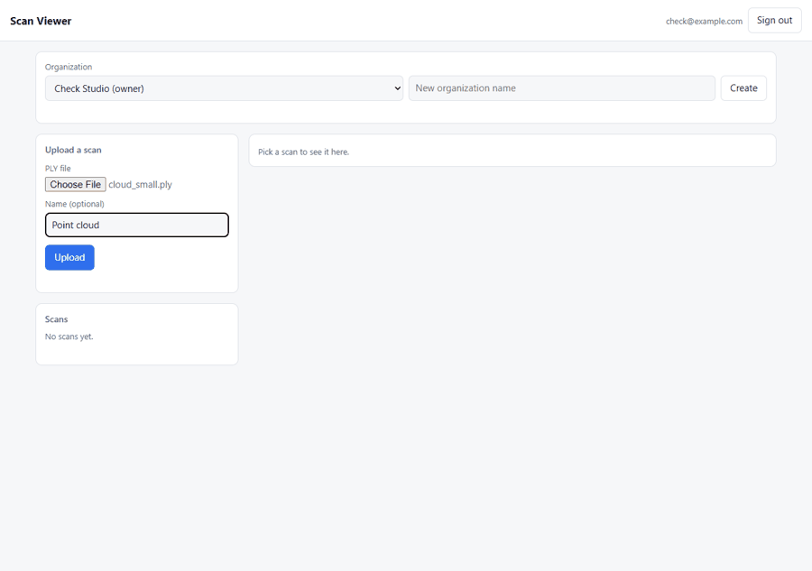
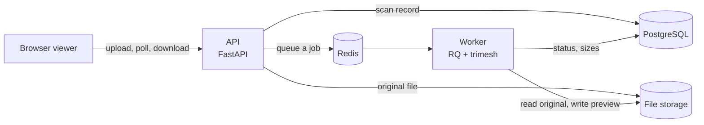

# Scan Service

Upload a 3D scan, let a background worker shrink it into a small preview, and look at it in your browser. Access is controlled by organization roles.



## What it does

1. You upload a `.ply` file (a point cloud or a mesh).
2. The API checks it quickly and answers right away. Nothing heavy happens in the request.
3. A worker reads the file, thins it out, and writes a GLB preview. A good preview is about 90 percent smaller than the original.
4. The page shows the scan's status as it moves along, then opens the preview in 3D.



A scan moves through these states, and only the worker moves it forward:

`uploaded` → `validating` → `processing` → `ready`  (or `failed`, with a reason in plain words)

## Run it

You need Docker. From the project folder:

```
docker compose up --build
```

Then open <http://localhost:8000>. If something else already uses port 8000, pick another port:

```
API_PORT=8010 docker compose up --build
```

(On Windows PowerShell: `$env:API_PORT=8010; docker compose up --build`.)

The first thing you see is a sign-in page. Create an account, create an organization, and upload a scan. There are no real scans in this repo, so make some:

```
python -m tools.scangen samples
```

That writes point clouds, meshes, and a few deliberately broken files into `samples/`. Upload the good ones to see previews, and the `bad_` ones to see failures with a reason.

The API docs, with a working Authorize button, are at `/docs`.

## Develop it

You need Python 3.13 and Node (Node is only for one small test file).

```
python -m venv .venv
.venv\Scripts\activate            # macOS/Linux: source .venv/bin/activate
pip install -r requirements-dev.txt
alembic upgrade head              # creates dev.db, a local SQLite file
pytest
node --test viewer/scan-state.test.mjs
```

The tests need no database server, no Redis, and no Docker. They use an in-memory database and a fake queue.

Three helper scripts check the real thing:

| Script | What it does |
|---|---|
| `python -m tools.browser_check` | Drives the real page in Microsoft Edge: signs up, uploads, waits, confirms the 3D view draws, and signs in as a viewer. Add `--gif` to rebuild the demo GIF. Needs `pip install playwright pillow`. |
| `python -m tools.stack_check http://localhost:8000` | Uploads every sample to a running Docker stack and checks the previews it gets back. |
| `python -m tools.measure samples` | Prints the size reduction for each sample scan. |

The RQ worker does not run on Windows. Use Docker for it. Tests call the worker function directly, so they work everywhere.

## Deploy to Vercel

The repo is set up to deploy on [Vercel](https://vercel.com). Vercel runs the app as short-lived serverless functions, so a few things work differently there. The app switches to a "Vercel mode" by itself when it sees Vercel's `VERCEL` variable:

| | Docker (default) | Vercel mode |
|---|---|---|
| Where files live | Local disk | Inside Postgres |
| Who processes a scan | A separate worker, through Redis | The upload request itself, so a scan is already `ready` when the upload returns |
| Largest upload | 200 MB | **4 MB**. Vercel refuses request bodies over 4.5 MB |
| Stuck-scan sweeper | Runs inside the API | A daily Vercel Cron call to `/api/v1/internal/sweep` |
| Database connections | Pooled | Not pooled. Use your host's pooled connection string |

To deploy:

1. **Make a Postgres database.** The Neon integration in the Vercel Marketplace works. Copy the pooled connection string.
2. **Create the tables once, from your computer.**
   ```
   set DATABASE_URL=<your connection string>        # macOS/Linux: export DATABASE_URL=...
   alembic upgrade head
   ```
3. **Import the GitHub repo** at <https://vercel.com/new>. Vercel finds the FastAPI app on its own, and `vercel.json` sets the timeout and the cron.
4. **Set three environment variables** in the project settings:

   | Name | Value |
   |---|---|
   | `DATABASE_URL` | The connection string from step 1 |
   | `SECRET_KEY` | A long random string: `python -c "import secrets; print(secrets.token_urlsafe(48))"` |
   | `CRON_SECRET` | Another random string. Vercel sends it to the cron call. Leave it out and the sweep endpoint stays off |

5. **Deploy**, then open the URL. The viewer is the home page.

The app refuses to start on Vercel without a real `SECRET_KEY`.

**Not yet tried on Vercel itself.** Everything above was tested by running the app locally with Vercel's variables set, plus 29 tests of the new behaviour. Nobody has deployed it to a real Vercel project, so the first deploy is the real test. The things most likely to need a tweak are Vercel finding the app and the viewer files, and cold-start time. The 4 MB limit is the main thing to know: it comes from Vercel, and lifting it would mean uploading straight to Vercel Blob from the browser, which is not built.

## Roles

| Action | Viewer | Editor | Owner |
|---|---|---|---|
| See scans, open previews | yes | yes | yes |
| Upload and delete scans | no | yes | yes |
| Add, change, remove members | no | no | yes |

An organization always keeps at least one owner. Someone who is not in an organization gets `404`, not `403`, so ids of other organizations are not revealed.

## API

Everything lives under `/api/v1`. Errors always look like `{"error": "code", "message": "text"}`.

| Method and path | Who | Notes |
|---|---|---|
| `POST /auth/register`, `POST /auth/login` | anyone | Return a bearer token |
| `GET /orgs`, `POST /orgs` | signed in | Your organizations, or make one (you become owner) |
| `GET /orgs/{id}` | viewer | Members and your role |
| `POST /orgs/{id}/members` | owner | Add by email |
| `PATCH` / `DELETE /orgs/{id}/members/{user}` | owner | Change a role, or remove |
| `POST /orgs/{id}/scans` | editor | Multipart upload. Answers `202` |
| `GET /orgs/{id}/scans` | viewer | Newest first, paged with `limit` and `offset` |
| `GET /scans/{id}` | viewer | Status and sizes |
| `GET /scans/{id}/preview` | viewer | The GLB. `409` until the scan is ready |
| `DELETE /scans/{id}` | editor | Removes the scan and its files |

## How big is the reduction?

Measured on generated scans with `python -m tools.measure samples`, and again through the full Docker stack. Both runs gave the same numbers.

| File | Original | Preview | Smaller |
|---|---|---|---|
| cloud_large | 7.5 MB | 0.80 MB | 89.3% |
| cloud_small | 0.30 MB | 0.03 MB | 89.0% |
| mesh_large | 9.5 MB | 0.90 MB | 90.5% |
| mesh_small | 0.13 MB | 0.01 MB | 89.8% |

The average is **89.6 percent**. That is about 90, not at least 90. There are four files, and they are synthetic: a noisy sphere and a wavy sheet are tidier than a real room. Real scans may land somewhere else, so measure on yours before relying on the number. Scans below 500 triangles or 2,000 points are kept whole, so tiny scans barely shrink.

Processing the largest sample takes about a second.

## What was checked

- 142 Python tests pass. They cover the full upload path, every kind of bad file, a 45-case permission matrix (9 endpoints, 5 kinds of caller), and Vercel mode. I broke the code on purpose twice to confirm the tests notice: letting viewers upload, and adding a model column with no migration. Both were caught.
- 6 tests cover the page's helper functions.
- The browser check passes in a real browser, including the viewer role.
- The Docker stack ran end to end on real PostgreSQL, Redis and an RQ worker: migrations ran, seven of the eight samples were accepted and finished in under five seconds (the eighth, a text file renamed to `.ply`, was rejected at upload), the four good scans became valid GLB previews, and the three broken ones failed with a clear reason.
- With Redis stopped, an upload returned `503` and left nothing behind. The worker picked up again when Redis came back.

## Limits worth knowing

- **PLY only.** Other formats are turned away.
- **Tested on generated scans only.** No real scans were available.
- **Storage.** Files sit on local disk, or inside Postgres in Vercel mode, behind a small storage interface. S3 would be a new implementation of that interface. Database storage keeps whole files in memory and grows the database, so it only suits small files.
- **No Draco compression.** The GLB is plain, so the viewer needs no decoder.
- **Mesh previews lose vertex colours.** Point clouds keep theirs.
- **Point clouds are thinned by random sampling.** Density can look uneven. Voxel downsampling would be the next thing to try.
- **Tokens last an hour and cannot be revoked.** There are no refresh tokens, no email verification, and no password reset.
- **The token lives in `sessionStorage`.** Safer storage would need cookie handling and CSRF protection.
- **Uploads declared with no size** are only caught after they arrive. Put a reverse proxy in front for real use.
- **Failed scans are not retried.** The user uploads again.
- **No scale testing.** Nothing here says how it behaves with many users or very large scans.
- Outside `ENVIRONMENT=dev`, the app refuses to start unless `SECRET_KEY` is set to 32 or more characters.

## Where things are

```
app/
  api/v1/        routes (auth, orgs, scans, health)
  core/          settings, passwords and tokens, permissions, errors
  services/      storage, upload checks, processing, queue
  worker.py      the background job
  maintenance.py fails scans that are stuck
migrations/      Alembic migrations
vercel.json      Vercel settings (timeout, cron). .vercelignore trims the bundle
viewer/          the page, plus Three.js in vendor/
tools/           sample scan generator, size measurement, browser and stack checks
tests/           pytest suite
docs/demo.gif    the demo above
PLAN.md          the plan this was built from
LOG.md           every design decision, trade-off and bug, with reasons
```

`LOG.md` is the place to look when you wonder why something is the way it is.
